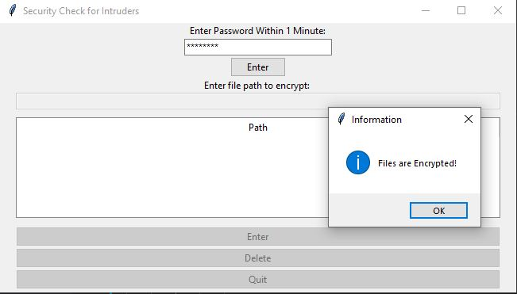

<h2>Inquirer</h2>

<b>This application aims to prevent intruders from getting private files in the computer. This Python script uses Tkinter GUI package to ask you to enter the predefined password periodically and checks whether the real owner of the computer is you or not.</b>

<ul>
<li> First you enter the folder paths that includes your private files. You may make changes on these paths after entering password correctly.</li>
<li> If password is entered incorrectly or not entered at all within 60 seconds, then all the files in the predefined paths will be encrypted using <b>Fernet cryptography</b></li>
<li> If you enter the password correctly afterwards, the files will be decrypted back again.</li>
</ul>

Packages that are needed for the script:
 <ul>
<li> You must have MySQL installed. Also you need mysql-connector package added.</li>
<li> 'cryptography' is needed for encrypt/decrypt files.</li>
<li> Finally you need to install 'tk' package for Tkinter GUI.</li>
</ul>
